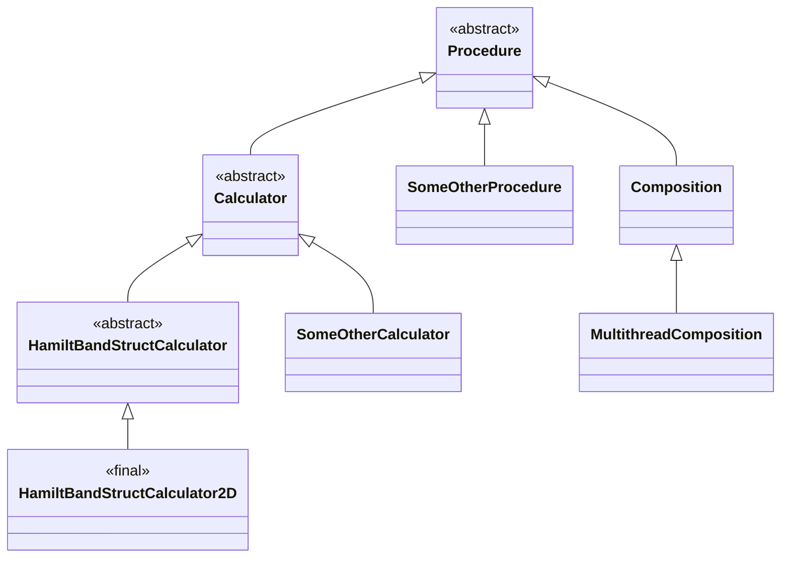

# Основополагающий принцип открытости-закрытости модуля
Структура классов расчётной программы:

Классы `Procedure`, `Calculator` и `Composition` сделаны открытыми,
чтобы можно было добавлять новые алгоритмы расчёта,
использующие новые типы данных.

Класс `HamiltBandStructCalculator` - абстрактный вычислитель.
Его потомки работают с разными типами данных
в зависимости от размерности пространства (1D и 3D спрятаны для упрощения схемы).
Эти потомки сделаны закрытыми, так как логика расчёта зонной структуры
не предполагает каких-то ещё вариантов для декартовой системы координат
с заданным количеством измерений.
Другие системы координат можно учитывать,
добавляя новые потомки `HamiltBandStructCalculator`.

Класс `Composition` отличается от `Calculator` тем, что он не абстрактный.
Этот класс позволяет создавать процедуры декларативно, собирая их из других
процедур.
В дальнейшем предполагается расширение языка декларативного описания
таких составных процедур, например, с указанием блоков для автоматического
распараллеливания.
Поэтому этот класс сделан открытым.

Пример работы такой схемы:
  - Создаётся `MultithreadComposition` с описанием схемы расчёта на расширенном языке.
  - `MultithreadComposition` переводит это описание на язык `Composition`,
    добавляя узлы для распараллеливания, и вызывает конструктор родителя.
  - `Composition` создаёт все узлы и обслуживает их работу, дублировать этот код
    в `MultithreadComposition` уже не нужно.