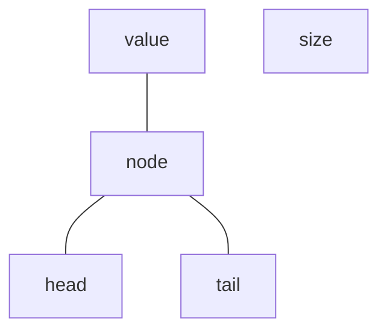
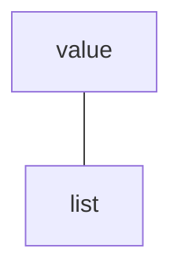
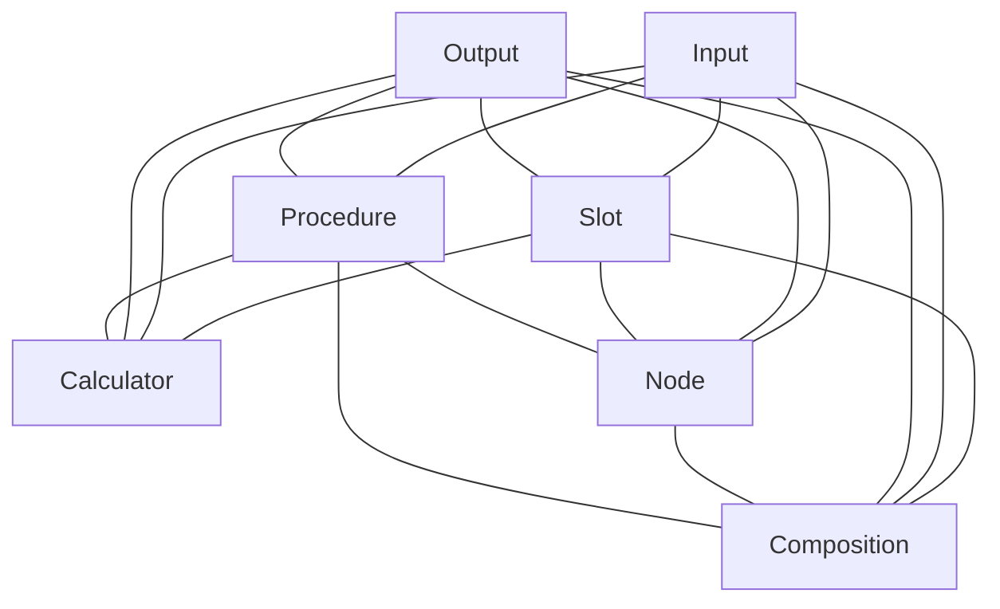
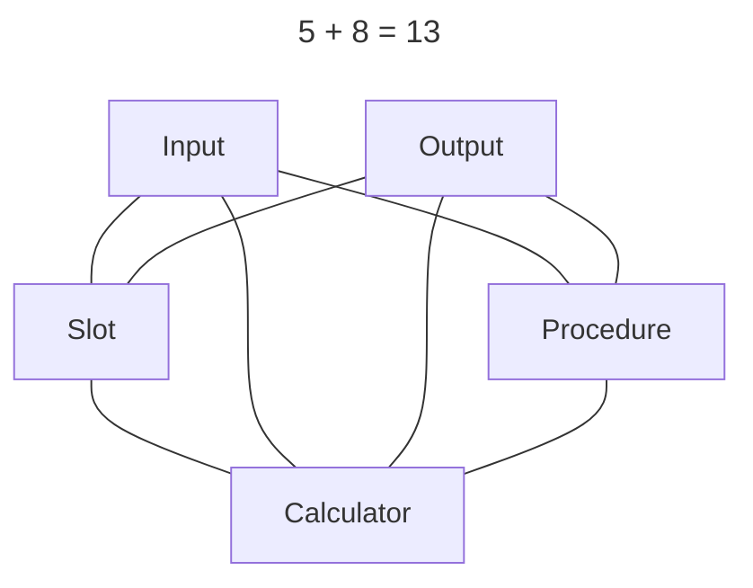
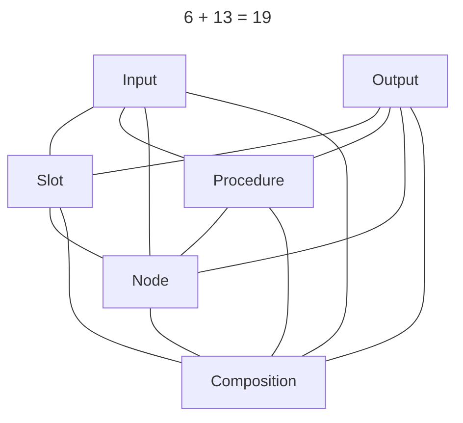
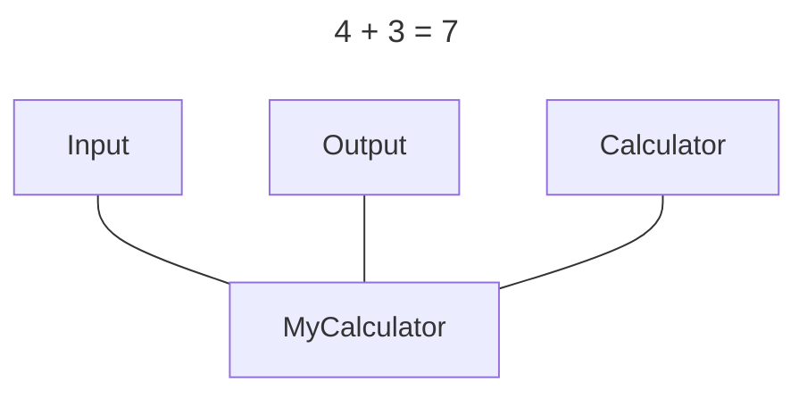
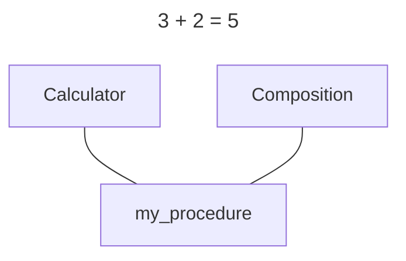
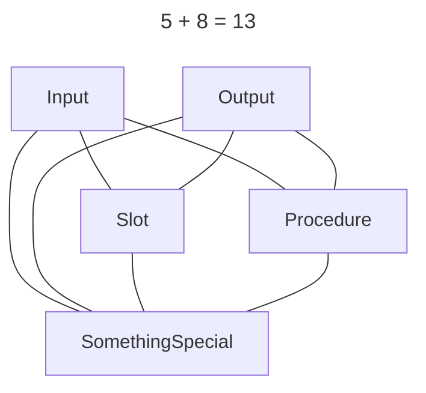

# Разбираемся с модульным противоречием

## Когда нужны публичные связи между модулями
Простейший случай - когда один модуль оперирует с другими модулями.
Например - модуль с функциями для работы со строками публично связан со
строковым типом.
В общем случае предпочтительна связь не с конкретным типом,
а с абстрактным интерфейсом.

Рассмотренный пример - частный случай более общей концепции.
Модуль с функциями предоставляет как бы набор деталей конструктора,
из которых уже составляется программа.
Разработчик модуля заранее не знает как они будут скомбинированы,
иначе эту комбинацию можно было бы обернуть в абстрактный интерфейс.
Такое "обёртывание" использовалось в предыдущем курсе со списками:
пользователю не нужен доступ к узлам и связям,
он работает с абстрактным курсором.

То есть, связи между модулями должны быть публичными,
если предполагается комбинировать модули с помощью этих связей.

Существует, правда, альтернативный подход - предоставить интерфейс для
декларативного описания комбинации модулей.
Тогда связи, да и сами модули, можно сделать приватными.

## Метрики для оценки организации модулей
Я бы предложил посчитать количество сущностей и связей между ними,
которые нужно одновременно держать в голове для понимания программы.

Рассмотрим, например, некий алгоритм, который работает со списком.
Если список не реализован в виде АТД, то в коде будет явно присутствовать
тип `node`, а также "указатели" на начало и конец списка (`head`, `tail`).
Ещё нам понадобится размер списка `size`.

Вот как это выглядит:

Сложность: 8 = 5 сущностей + 3 связи.
Можно порассуждать, что считать связью, но для иллюстрации это не важно.
Нужно отметить, что эта сложность **добавляется** к сложности самого алгоритма,
поскольку он должен заботиться о правильной организации списка.

> Такой недостаток характерен для программ, где абстракция есть на уровне
> логики, но не выделена ни в какую сущность на уровне кода.

Теперь используем абстракцию списка:

Сложность: 3 = 2 сущности + 1 связь.
Остальные сущности спрятались внутри списка,
и их сложность **не добавляется** к сложности алгоритма.

В более крупных системах с несколькими уровнями абстракций выигрыш будет больше
на порядки.

## Метрики для моих расчётных программ
Модуль `procedures` содержит несколько интерфейсов и классов:

Сложность: 7 + 17 = 24.
Это довольно много, но это внутренняя сложность, которая не добавляется к
коду других модулей.
Более того, классы `Calculator` и `Composition` независимы,
поэтому их можно рассматривать отдельно:

В пользовательском коде сложность гораздо ниже.

### Реализация класса `Calculator`:

### Использование `Composition`:

### Какая-то особенная процедура:

